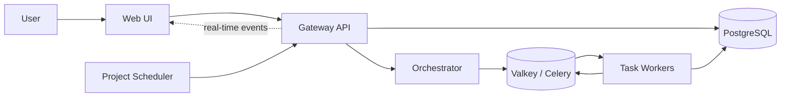

<div align="center">

# DVT

### Denvic Visual Transformer

**Build, run, and monitor data pipelines in a visual node-based workspace.**

[](LICENSE)
[](https://www.python.org/)
[](https://www.docker.com/)
[](https://github.com/Denvic-Tech/dvt)

[Getting started](#getting-started) · [Features](#features) · [Architecture](#architecture) · [Development](docs/DEVELOPMENT.ru.md) · [License](#license)

</div>

---

## What is DVT?

DVT is an open-source visual ETL platform for creating and executing data pipelines as graphs of reusable nodes.

Instead of wiring every workflow together in code, you build a pipeline in the web UI, connect data sources, transformations, and destinations, then run and monitor it through DVT's distributed execution backend.

DVT is designed for self-hosted environments and extensibility: the platform provides a Node DSL, an extension system, APIs, scheduling, real-time execution events, and a worker-based runtime for scaling pipeline execution.

## Features

<table>
<tr>
<td width="50%" valign="top">

### 🧩 Visual pipelines

Build ETL workflows in a node-based editor and keep complex data flows understandable at a glance.

### ⚡ Distributed execution

Run pipelines asynchronously through task workers backed by PostgreSQL, Celery, and Valkey.

### 🧱 Extensible Node DSL

Create reusable sources, transformations, destinations, and system nodes using DVT's Python DSL.

### 🧰 Extension system

Add functionality through documented extension interfaces without having to modify DVT Core.

</td>
<td width="50%" valign="top">

### 🗓️ Scheduling

Run projects automatically on cron schedules using the built-in project scheduler.

### 📡 Real-time monitoring

Receive execution status and events in the UI over WebSocket while pipelines are running.

### 🔌 API-first backend

Use the FastAPI Gateway and OpenAPI surface to integrate DVT with surrounding systems.

### 🐳 Self-hosted deployment

Deploy DVT on your own infrastructure with Docker and Docker Compose.

</td>
</tr>
</table>

## Getting started

### Run DVT with the installer

The easiest way to start a self-hosted DVT instance is through the included web installer.

**Requirements:**

- Linux host
- Docker
- Docker Compose

Clone the repository and start the installer:

```bash
git clone --recurse-submodules https://github.com/Denvic-Tech/dvt.git
cd dvt
chmod +x install.sh
./install.sh
```

By default, the installer starts on:

```text
http://localhost:8888
```

The installation directory defaults to `/var/lib/dvt`. Both the directory and installer port can be changed through installer arguments.

### Start the development stack

For local development, clone the repository with its UI submodule:

```bash
git clone --recurse-submodules https://github.com/Denvic-Tech/dvt.git
cd dvt
```

Then start the Docker development environment:

```bash
docker compose --project-directory . \
  -f docker/docker-compose.base.yaml \
  -f docker/docker-compose.dev.yaml \
  up --build
```

Default development endpoints include:

| Service | URL |
| --- | --- |
| DVT UI | `http://localhost:81` |
| Gateway API docs | `http://localhost:8001/api/docs` |
| Project Scheduler API docs | `http://localhost:8002/docs` |
| Reverse proxy | `http://localhost:80` |

For Python environment setup, individual service startup, migrations, testing, Docker workflows, UI submodule handling, and troubleshooting, see the **[Development Guide](docs/DEVELOPMENT.ru.md)**.

## Architecture

DVT separates the public API, orchestration, execution, scheduling, and UI into focused services while keeping PostgreSQL as the authoritative task lifecycle store.



### Main components

- **Gateway** — FastAPI entrypoint for authentication, projects, graphs, execution APIs, OpenAPI, and WebSocket communication.
- **Orchestrator** — manages durable dispatch and worker lifecycle reconciliation.
- **Task Worker** — executes pipelines using the shared runtime and Node DSL.
- **Project Scheduler** — triggers scheduled project runs.
- **UI** — visual node editor maintained in the [`Denvic-Tech/dvt-ui`](https://github.com/Denvic-Tech/dvt-ui) repository and pinned here as a Git submodule.
- **PostgreSQL** — authoritative storage for projects, graphs, tasks, schedules, and lifecycle state.
- **Valkey / Celery** — task transport, worker communication, and execution telemetry.

More implementation details are available in the **[Development Guide](docs/DEVELOPMENT.ru.md)**.

## Repository layout

```text
src/                 Core application and pipeline runtime
services/            Deployable backend services and UI submodule
core/                Shared infrastructure primitives
contracts/           gRPC / protobuf contracts
dvt_extension_api/   Public extension API
extensions/          Extension packages and runtime integrations
migrations/          Database migrations
docker/              Development and test Compose configuration
scripts/             Service, Docker, and maintenance helpers
tests/               Unit, integration, and end-to-end tests
docs/                Project documentation
```

## Extending DVT

DVT is built around extensibility at two levels:

1. **Nodes** — implement new ETL capabilities using the Node DSL in `src/nodes/`.
2. **Extensions** — integrate additional functionality through the documented DVT Extension Interfaces.

The DVT Core is licensed under AGPLv3. The repository also includes a **DVT Extension Exception** that permits qualifying extensions to use separate licenses when they interact with DVT Core exclusively through the documented extension interfaces. See [`COPYING`](COPYING) for the complete terms.

## Contributing

Contributions are welcome.

Before making changes:

1. Read the **[Development Guide](docs/DEVELOPMENT.ru.md)** for environment setup, architecture, and test workflows.
2. Keep changes focused and add tests for behavior you introduce or modify.
3. Run the relevant full unit and integration suites before opening a pull request.
4. Use the public GitHub repository as the source of truth for contributions.

Developer and coding-agent conventions are documented in [`AGENTS.md`](AGENTS.md).

## Related repositories

- **DVT Core:** [`Denvic-Tech/dvt`](https://github.com/Denvic-Tech/dvt)
- **DVT UI:** [`Denvic-Tech/dvt-ui`](https://github.com/Denvic-Tech/dvt-ui)

## License

DVT Core is licensed under the **GNU Affero General Public License v3.0 (AGPL-3.0-only)**.

See [`LICENSE`](LICENSE) for the full AGPLv3 text and [`COPYING`](COPYING) for the DVT licensing terms and Extension Exception.

---

<div align="center">

**DVT — visual pipelines, open infrastructure.**

</div>
