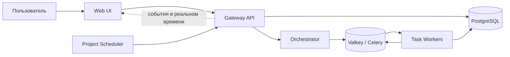

<div align="center">

# DVT

### Denvic Visual Transformer

**Создавайте, запускайте и отслеживайте конвейеры обработки данных в визуальном рабочем пространстве на основе нод.**

[](../LICENSE)
[](https://www.python.org/)
[](https://www.docker.com/)
[](https://github.com/Denvic-Tech/dvt)

[Начало работы](#начало-работы) · [Возможности](#возможности) · [Архитектура](#архитектура) · [Разработка](DEVELOPMENT.ru.md) · [English](../README.md) · [Лицензия](#лицензия)

</div>

---

## Что такое DVT?

DVT — это open-source визуальная ETL-платформа для создания и выполнения конвейеров обработки данных в виде графов из переиспользуемых нод.

Вместо того чтобы описывать каждый workflow в коде, вы собираете pipeline в веб-интерфейсе, соединяете источники данных, преобразования и целевые системы, после чего запускаете и отслеживаете выполнение через распределённый backend DVT.

DVT рассчитан на self-hosted-развёртывание и расширяемость: платформа предоставляет Node DSL, систему расширений, API, планировщик, события выполнения в реальном времени и worker-based runtime для масштабирования выполнения pipeline-ов.

## Документация и внешние ссылки

- Основная пользовательская документация: https://docs.denvic.tech/dvt_docs/dvt_docs/
- Сайт разработчика и техническая поддержка (расширенные планы): https://denvic.tech/products/dvt-visual-etl/
- Канал поддержки: https://t.me/extractor1CBI

## Возможности

<table>
<tr>
<td width="50%" valign="top">

### 🧩 Визуальные pipeline-ы

Создавайте ETL-workflow в редакторе на основе нод и сохраняйте сложные потоки данных понятными с первого взгляда.

### ⚡ Распределённое выполнение

Запускайте pipeline-ы асинхронно через task worker-ы на базе PostgreSQL, Celery и Valkey.

### 🧱 Расширяемый Node DSL

Создавайте переиспользуемые источники, преобразования, целевые ноды и системные ноды с помощью Python DSL от DVT.

### 🧰 Система расширений

Добавляйте функциональность через документированные интерфейсы расширений без необходимости изменять DVT Core.

</td>
<td width="50%" valign="top">

### 🗓️ Планирование

Автоматически запускайте проекты по cron-расписанию с помощью встроенного Project Scheduler.

### 📡 Мониторинг в реальном времени

Получайте статусы выполнения и события в UI через WebSocket во время работы pipeline-ов.

### 🔌 API-first backend

Используйте FastAPI Gateway и OpenAPI-интерфейс для интеграции DVT с окружающими системами.

### 🐳 Self-hosted-развёртывание

Разворачивайте DVT на собственной инфраструктуре с помощью Docker и Docker Compose.

</td>
</tr>
</table>

## Начало работы

### Запуск DVT через установщик

Самый простой способ запустить собственный экземпляр DVT — воспользоваться встроенным веб-установщиком.

**Требования:**

- Linux-хост
- Docker
- Docker Compose

Клонируйте репозиторий и запустите установщик:

```bash
git clone --recurse-submodules https://github.com/Denvic-Tech/dvt.git
cd dvt
chmod +x install.sh
./install.sh
```

По умолчанию установщик запускается на:

```text
http://localhost:8888
```

По умолчанию DVT устанавливается в `/var/lib/dvt`. И директорию установки, и порт установщика можно изменить через его аргументы.

### Запуск development-окружения

Для локальной разработки клонируйте репозиторий вместе с UI-сабмодулем:

```bash
git clone --recurse-submodules https://github.com/Denvic-Tech/dvt.git
cd dvt
```

Затем запустите Docker development environment:

```bash
docker compose --project-directory . \
  -f docker/docker-compose.base.yaml \
  -f docker/docker-compose.dev.yaml \
  up --build
```

Стандартные локальные endpoints:

| Сервис | URL |
| --- | --- |
| DVT UI | `http://localhost:81` |
| Документация Gateway API | `http://localhost:8001/api/docs` |
| Документация Project Scheduler API | `http://localhost:8002/docs` |
| Reverse proxy | `http://localhost:80` |

Настройка Python-окружения, запуск отдельных сервисов, миграции, тестирование, Docker-workflow, работа с UI-сабмодулем и troubleshooting описаны в **[руководстве разработчика](DEVELOPMENT.ru.md)**.

## Архитектура

DVT разделяет публичный API, оркестрацию, выполнение, планирование и UI на отдельные специализированные сервисы, при этом PostgreSQL остаётся авторитетным хранилищем жизненного цикла задач.



### Основные компоненты

- **Gateway** — FastAPI entrypoint для аутентификации, проектов, графов, API выполнения, OpenAPI и WebSocket-коммуникации.
- **Orchestrator** — управляет durable dispatch и reconciliation жизненного цикла worker-ов.
- **Task Worker** — выполняет pipeline-ы через общий runtime и Node DSL.
- **Project Scheduler** — запускает проекты по расписанию.
- **UI** — визуальный редактор нод, который разрабатывается в репозитории [`Denvic-Tech/dvt-ui`](https://github.com/Denvic-Tech/dvt-ui) и подключён сюда как Git-сабмодуль.
- **PostgreSQL** — авторитетное хранилище проектов, графов, задач, расписаний и lifecycle-состояния.
- **Valkey / Celery** — транспорт задач, коммуникация с worker-ами и telemetry выполнения.

Дополнительные подробности реализации доступны в **[руководстве разработчика](DEVELOPMENT.ru.md)**.

## Структура репозитория

```text
src/                 Основное приложение и runtime pipeline-ов
services/            Развёртываемые backend-сервисы и UI-сабмодуль
core/                Общие инфраструктурные примитивы
contracts/           gRPC / protobuf-контракты
dvt_extension_api/   Публичный API расширений
extensions/          Пакеты расширений и runtime-интеграции
migrations/          Миграции базы данных
docker/              Development- и test-конфигурация Compose
scripts/             Скрипты сервисов, Docker и обслуживания
tests/               Unit-, integration- и end-to-end-тесты
docs/                Документация проекта
```

## Расширение DVT

DVT изначально строится с расширяемостью на двух уровнях:

1. **Ноды** — новые ETL-возможности реализуются через Node DSL в `src/nodes/`.
2. **Расширения** — дополнительная функциональность интегрируется через документированные DVT Extension Interfaces.

DVT Core распространяется по лицензии AGPLv3. В репозитории также присутствует **DVT Extension Exception**, которое позволяет подходящим расширениям использовать отдельные лицензии, если они взаимодействуют с DVT Core исключительно через документированные интерфейсы расширений. Полные условия приведены в [`COPYING`](../COPYING).

## Участие в разработке

Мы приветствуем вклад в проект.

Перед внесением изменений:

1. Прочитайте **[руководство разработчика](DEVELOPMENT.ru.md)** по настройке окружения, архитектуре и тестовым workflow.
2. Делайте изменения сфокусированными и добавляйте тесты для нового или изменённого поведения.
3. Перед открытием pull request запускайте соответствующие полные наборы unit- и integration-тестов.
4. Используйте публичный GitHub-репозиторий как основной источник для contributions.

Соглашения для разработчиков и coding-агентов описаны в [`AGENTS.md`](../AGENTS.md).

## Связанные репозитории

- **DVT Core:** [`Denvic-Tech/dvt`](https://github.com/Denvic-Tech/dvt)
- **DVT UI:** [`Denvic-Tech/dvt-ui`](https://github.com/Denvic-Tech/dvt-ui)

## Лицензия

DVT Core распространяется по лицензии **GNU Affero General Public License v3.0 (AGPL-3.0-only)**.

Полный текст AGPLv3 доступен в [`LICENSE`](../LICENSE), а условия лицензирования DVT и Extension Exception — в [`COPYING`](../COPYING).

---

<div align="center">

**DVT — визуальные pipeline-ы, открытая инфраструктура.**

</div>
